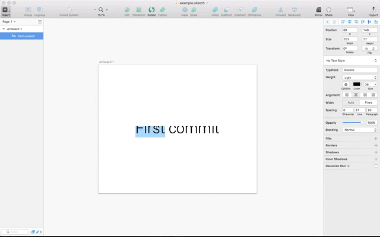

git-sketch-plugin
=========

 A Git client built right into [Sketch](http://www.bohemiancoding.com/sketch). Generate [pretty diffs](https://github.com/mathieudutour/git-sketch-plugin/pull/1/files) so that everybody knows what are the changes!

From ...

... To

## Requirements
* [Sketch](http://sketchapp.com/) >= 3.4 (**not** with the sandboxed version ie from the App Store).
* [Git](https://git-scm.com/) (coming with OS X so you shouldn't have to do anything)

## Installation
* [Download](https://github.com/mathieudutour/git-sketch-plugin/archive/master.zip) this repo as a zip
* Double-click on Git.sketchplugin

## Workflow
Once:
* Init the git repo (`Plugins > Git > Advanced > Init git repo`)
* Add all the sketch files you are working on the repo (`Plugins > Git > Advanced > Add file to git`)

Then:
* Create a new branch when you start working on a new feature (`Plugins > Git > New branch`)
* Work normally on your design
* Save the file
* Commit the changes with a meaningful message describing them. The plugin will extract the artboards in your file in order to show the differences easily. (`Plugins > Git > Commit`)
* Push your changes to the remote. (`Plugins > Git > Push`)
* Create a pull request from your branch to the master branch.
* Voila. Your co-workers can review the changes, comment on them and approve them. Once approved, merge the pull request.

For a more in-depth explanation of a nice git flow, check out [this article](https://about.gitlab.com/2014/09/29/gitlab-flow/).

## Enabling Git LFS _(optional)_

Git LFS is an extension for git that enables a quicker way to push and pull changes that involve binary files, like `.png` and `.sketch`. It is not critical to using this plugin, but it may help maintain a healthy git repository.

_Note: In using the Git LFS extension, all contributors must have it installed, and the git remote (ie Github, Bitbucket, Gitlab) must have it enabled with sufficient storage available to the hosting account._

Start by enabling LFS for your repo:

1. [Downloading and install](https://git-lfs.github.com/) Git LFS to your machine
2. Go into the terminal for your repo (through Sketch, `Plugins > Git > Advanced > Open terminal`)
3. Paste the following into your repo, `git lfs install && git lfs track '*.png' && git lfs track '*.sketch' && git add .gitattributes`
4. Thats it. You need only run these commands once. Your team mates will have to download and install Git LFS onto their machines as well (so, just step 1).

## Default key bindings

 Action                       | Shortcut
:-----------------------------|:---------------------------------------
 Commit your changes          | <kbd>ctrl</kbd> + <kbd>alt</kbd> + <kbd>cmd</kbd> + <kbd>c</kbd>
 Push your changes            | <kbd>ctrl</kbd> + <kbd>alt</kbd> + <kbd>cmd</kbd> + <kbd>p</kbd>
 Create a new branch          | <kbd>ctrl</kbd> + <kbd>alt</kbd> + <kbd>cmd</kbd> + <kbd>n</kbd>
 Switch to an existing branch | <kbd>ctrl</kbd> + <kbd>alt</kbd> + <kbd>cmd</kbd> + <kbd>o</kbd>

## Git command behind

Client                       | Command
:----------------------------|:------------------------------------------
 Commit                      | `git commit -m 'message' -a`
 Push                        | `git -c push.default=simple push -q`
 New Branch                  | `git checkout -qb branchName`
 Switch Branch               | `git checkout -q branchName`
 Pull                        | `git pull`
 Add file to git             | `git add currentFile`
 Init Git repo               | `git init && git add currentFile`

## License

MIT
